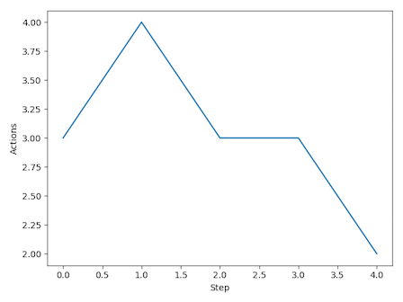

## TODOs

* Profile memory
* Note that only FF policy implemented
* Check that episode rewards/lengths get logged
* Check that detailed logs still work
* Note that preprocessing is the hardest thing to get right
* Check setup instructions pipenv
* check tensorflow version on Euler
* test pipenv on Euler
* Clean up runs repo
* TODO: how much faster? How much slower than A2C?

# TensorFlow A3C

TensorFlow implementation of [A3C](https://arxiv.org/abs/1602.01783) using OpenAI Gym,
crafted with love, kindness - and since deep RL is
[apparently hard to get right](https://blog.openai.com/openai-baselines-dqn/),
lots and lots of testing.


## Usage

### Python setup

To set up an isolated environment and install dependencies, install
[Pipenv](https://github.com/pypa/pipenv), then just run:

`$ pipenv install`

However, note that TensorFlow must be installed manually. Either:

`$ pipenv run pip install tensorflow`

or

`$ pipenv run pip install tensorflow-gpu`

depending on whether you have a GPU. (If you run into problems, try installing TensorFlow 1.8.0,
which was used for development.)

If you want to run tests, also run:

`$ pipenv install --dev`

Finally, before running any of the scripts, enter the environment with:

`$ pipenv shell`

### Running

We support Atari environments using the feedforward policy from
[Human-level control through deep reinforcement learning](https://www.nature.com/articles/nature14236)
(though extending to other environments or policies shouldn't be hard). Basic usage is:

```
$ python3 train.py --n_workers <no. of workers> <environment name>
```

For example, to train an agent on Pong using 16 workers:

```
$ python3 train.py --n_workers 16 PongNoFrameskip-v4
```

Logs and checkpoints will be saved to a new directory in `runs`. To specify the name of the
directory, specify `--run_name`.

Run `train.py` with no arguments to see full usage options, including tuneable hyperparameters.

Once training is completed, check out trained agent behaviour with:

```
$ python3 run_checkpoint.py <environment name> <checkpoint directory>
```

For example:

```
$ python3 run_checkpoint.py PongNoFrameskip-v4 runs/test-run_1534041413_cdc3bd9/checkpoints
```

## Special Features

OCD A3C comes with a couple of special testing features.

### Randomness checks

An annoying thing that happens with deep RL is a change which should be inconsequential apparently
breaking things because it inadvertently changes random seeding. To make it more obvious when this
might have happened, `train_test.py` runs a full end-to-end run checking that the weights are
exactly what they were after 100 updates in the previous version of the code.

### See through the eyes of the agent

Run `preprocessing_play.py` to play the game through the eyes of the agent using Gym's
[`play.py`](https://github.com/openai/gym/blob/a77b139e5875c2ab5c7ad894d0819a4e16c3f27f/gym/utils/play.py).
You'll see the full result of the preprocessing pipeline (including the frame stack,
spread out horizontally over time):


### See what the network sees

Still, what if we somehow manage to fumble something up between the preprocessing pipeline and
actually sending the frames into the policy network for inference or training?

Thanks to [`tf.Print`](https://www.tensorflow.org/api_docs/python/tf/Print), we can dump all data
going into the network then check offline that everything looks fine. This involves first running
`train.py` with the `--debug` flag and piping `stderr` to a log file:

```
$ python3 train.py PongNoFrameskip-v4 --debug 2> debug.log
```

Then, run `show_debug_data.py` on the resulting log:

```
$ python3 show_debug_data.py debug.log
```

You'll see the first five frame stacks used to choose actions on the first five steps in the
environment (with individual frames numbered - starting from 12 here because of the random number of
initial no-ops used to begin each episode):


Then the frame stack from the final state reached being fed into the network for value estimation:


Then the batch of the first five frames used for for the first training step with the corresponding
returns and actions:




Then the frame stack from the current state being fed into the network again to choose the first
action of the next set of steps:


And so on.

## Design notes

* The initial design ran each worker on a separate process, with replication of shared parameters
  done using Distributed TensorFlow. The hope was to increase speed by avoiding global interpreter
  lock, but Distributed TensorFlow seems to have a large overhead - it actually turned out to be
  faster to run the workers on threads, so that no replication is necessary, running only the
  environments in separate processes. This was inspired by OpenAI Baselines'
  [`SubprocVecEnv`](https://github.com/openai/baselines/blob/36ee5d17071424f30071bcdc72ff11b18c577529/baselines/common/vec_env/subproc_vec_env.py).
  
## Lessons learned

* Preprocessing
* Monte-Carlo returns
* Gradient clip
* 80/20 rule: hard to get really right
